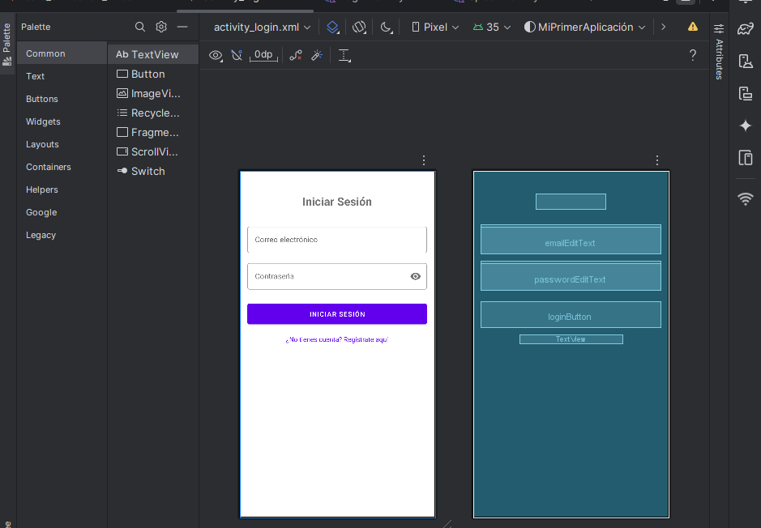
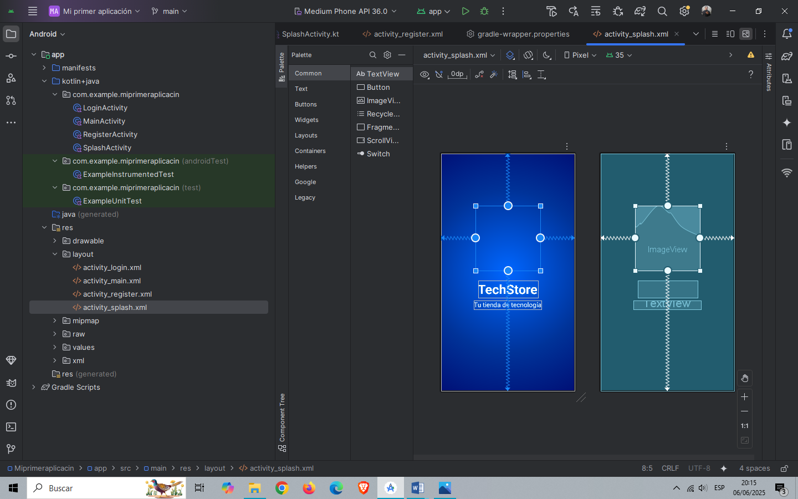
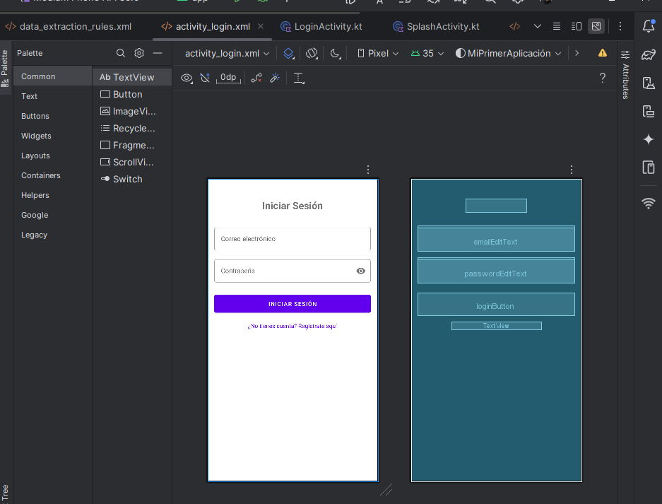
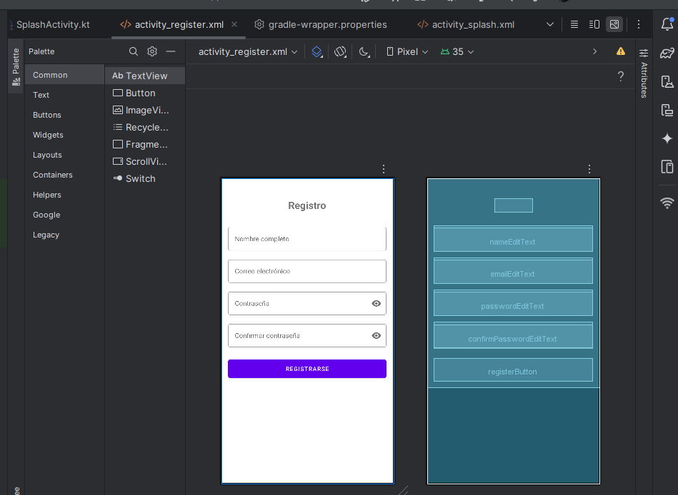

# Mi Primera Aplicación Android

Esta es una aplicación de Android que implementa un sistema de inicio de sesión y registro de usuarios con una pantalla de bienvenida animada.

## Pantallas de la Aplicación

### Pantalla de Bienvenida


### Detalles de la Animación


### Pantalla de Inicio de Sesión


### Pantalla de Registro


## Características
- Pantalla de bienvenida con animaciones
- Sistema de inicio de sesión
- Registro de nuevos usuarios
- Interfaz moderna y amigable

## Tecnologías Utilizadas
- Kotlin
- Android Studio
- XML para layouts
- Animaciones nativas de Android

# Mi Primera Aplicación 📱🎉

¡Bienvenido a **Mi Primera Aplicación**! Este proyecto está diseñado con un enfoque especial en la **experiencia de usuario (UX)**, asegurando que la interfaz sea **clara, accesible y fácil de usar**. A continuación, te mostraré cómo se aplicaron principios clave en el diseño de la interfaz, con un énfasis particular en la **usabilidad** y la **accesibilidad**.

---


markdown
Copy code
# 📱 Mi Aplicación de Interfaces de Usuario

Este proyecto consiste en una aplicación móvil con enfoque en el **diseño de interfaces de usuario (UI)** simples, modernas y accesibles. El objetivo principal es ofrecer una experiencia visual agradable y fluida al usuario a través de **tres pantallas clave**.

## 🧩 Estructura de la Aplicación

### 1️⃣ Pantalla de Bienvenida
- 🎞️ **Animación Inicial**: Al abrir la app, se muestra una animación representativa que capta la atención del usuario.
- 💡 **Objetivo**: Crear una primera impresión atractiva y moderna.
- 🌈 **Estilo visual**: Uso de colores vivos, elementos en movimiento y una transición suave hacia la siguiente pantalla.

### 2️⃣ Pantalla de Inicio de Sesión
- 🔐 **Interfaz Intuitiva**: Diseñada para que el usuario pueda iniciar sesión de forma rápida y sin complicaciones.
- 🧠 **Elementos clave**:
  - Campos de usuario y contraseña
  - Botón claro de "Iniciar Sesión"
  - Enlace para recuperar contraseña
- 🧭 **Navegación sencilla**: Distribución limpia y accesible en todos los dispositivos.

### 3️⃣ Pantalla de Registro
- 📝 **Formulario Accesible**: Facilita el registro de nuevos usuarios con una estructura clara.
- 🔍 **Componentes**:
  - Campos de nombre, email y contraseña
  - Indicaciones visuales en caso de errores
- ♿ **Accesibilidad**: Contrastes adecuados y botones fácilmente clicables.

## 🎨 Principios de Diseño Utilizados
- **Simplicidad visual**: Interfaces limpias, sin sobrecargar al usuario.
- **Consistencia**: Uso coherente de colores, fuentes y botones.
- **Enfoque en el usuario**: Cada pantalla está pensada para ser clara, rápida y fácil de usar.

## 🌟 Características Principales del Diseño

### 1. **Claridad y Simplicidad en el Diseño** 🧑‍💻
El diseño de la aplicación se basa en el principio de **simplicidad visual**, evitando elementos innecesarios que puedan distraer al usuario. Las pantallas están organizadas de forma lógica, de modo que los usuarios puedan navegar rápidamente y realizar tareas sin complicaciones.


### 2. **Uso Adecuado de Colores y Tipografía** 🌈
El **uso de colores** en la interfaz ha sido cuidadosamente seleccionado para garantizar un buen contraste y facilitar la lectura. Los colores son suaves y agradables a la vista, lo que mejora la experiencia de navegación. La tipografía se eligió para ser legible, clara y coherente, con una jerarquía visual bien definida para ayudar al usuario a entender rápidamente la estructura de la interfaz.


### 3. **Navegación Fluida Entre Pantallas** 🔄
La **navegación** entre las distintas pantallas de la aplicación es **intuitiva** y **sin interrupciones**. Cada transición entre pantallas está pensada para que el usuario no se pierda ni se sienta desorientado. Los botones y enlaces están claramente identificados, y se utilizan **transiciones suaves** para mejorar la experiencia de uso.


### 4. **Experiencia de Usuario (UX) Centrada en la Usabilidad** 💡
Cada aspecto del diseño está centrado en la **usabilidad**. Las interacciones son rápidas y eficientes, con botones de tamaño adecuado y posicionados estratégicamente para facilitar el acceso. Además, se ofrece retroalimentación visual clara cuando se realizan acciones importantes (como enviar formularios o realizar compras).


### 5. **Accesibilidad** ♿
La accesibilidad es una prioridad en este proyecto. Hemos implementado características como:

- **Contrastes de color** adecuados para personas con daltonismo.
- **Compatibilidad con lectores de pantalla**.
- **Navegación mediante teclado** y accesibilidad para usuarios con movilidad reducida.
- **Textos alternativos** (alt-text) para imágenes.

---

## 📱 Diseño Responsivo

La aplicación está diseñada para ser **responsiva**, adaptándose perfectamente a dispositivos móviles, tabletas y escritorios. Las pantallas se ajustan para ofrecer una experiencia óptima sin importar el tamaño de la pantalla.

---

## 🤝 Contribuciones

¡Las contribuciones son bienvenidas! Si tienes ideas para mejorar el diseño, la funcionalidad o la accesibilidad, no dudes en hacer un **fork** del repositorio y enviar un **pull request**.

---

## 📬 Contacto y Comentarios

Si tienes preguntas, comentarios o sugerencias sobre el proyecto, por favor, abre un **issue** en este repositorio o contáctanos directamente. ¡Estaremos encantados de escuchar tus ideas!

---

### Licencia 📜

Este proyecto está bajo la **Licencia MIT**. Para más detalles, consulta el archivo `LICENSE`.

---

¡Gracias por visitar **Mi Primera Aplicación**! Esperamos que disfrutes de la experiencia y que encuentres útil la aplicación. 😊

```
